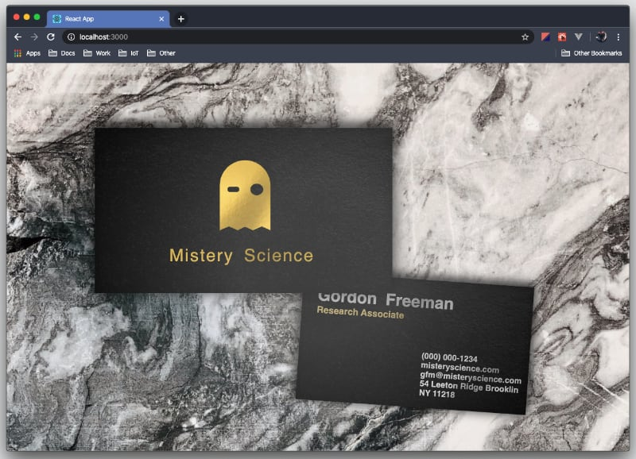

# React Conversion for JavaScript Tutorial



## Credits

- [Tutorial: How to make CSS Effect looks REAL by Red Stapler YouTube](https://www.youtube.com/watch?v=6oP0uQzup5A)

- [Marble Photo by Kira Schwarz from Pexels](https://www.pexels.com/photo/gray-and-black-marble-slab-1451474/)


- [Gold Texture by Katie Harp from Unsplash](https://unsplash.com/photos/Em96eDRJPD8)


## Available Scripts

Run Yarn to install project dependencies
```sh
$ cd projectFolder
$ yarn
```


Then in the project directory, you can run:

### `yarn start`

### `yarn test`

### `yarn build`
